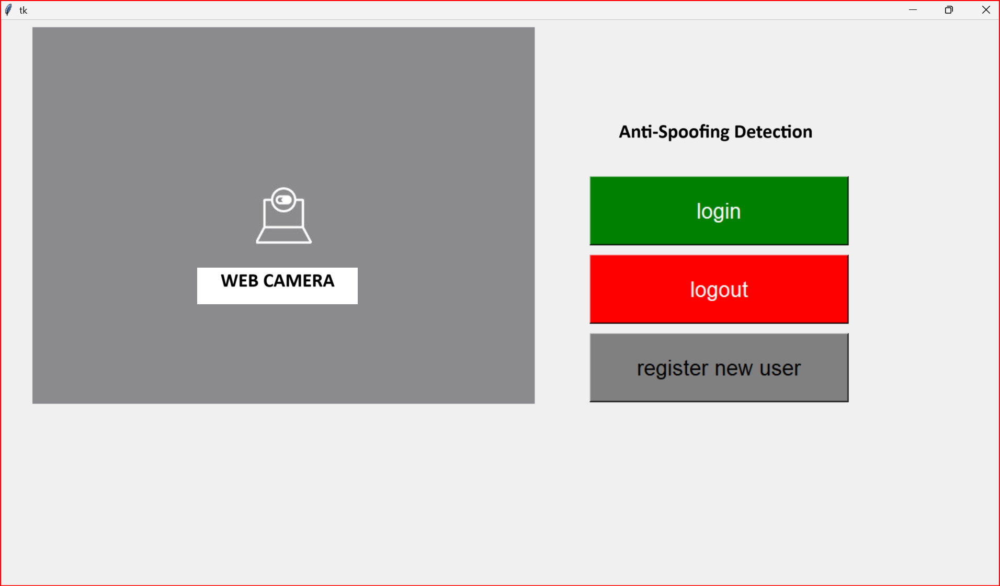

# 🧠 Fourier-Aware Spoofing Attacks Detection with Lightweight CNN Architecture

## 📌 Description
- Face recognition systems are increasingly deployed in security-sensitive environments (e.g., banking apps, smart devices, building access), but remain vulnerable to **presentation attacks** such as photos, videos, and 3D masks.
- These spoofing attacks can fool face recognition systems, posing serious security threats.
- **Silent face anti-spoofing** addresses this by detecting fake inputs **without requiring user interaction**, enabling a seamless and non-intrusive user experience.
- This project is inspired by [MiniVision AI's Silent-Face-Anti-Spoofing repository](https://github.com/minivision-ai/Silent-Face-Anti-Spoofing), and expands upon their work by refined  training methodologies with Fourier Transforms which is pruned and retrained version of MiniFASNet, carefully balancing model size and performance for real-time deployment and mobile readiness. and performance visualization.
- We implement a **two-branch architecture**:
  - **Primary Branch**: A lightweight CNN based on MiniFASNet for binary classification (real vs. spoof).
  - **Auxiliary Branch**: Incorporates **Fourier spectral supervision** to highlight frequency-domain differences between real and spoofed faces.
- The model uses **RetinaFace** for face detection and generates multiple patches at different scales (1.0×, 2.7×, 4.0×) to improve robustness across spatial contexts.
- Each image undergoes **Fourier Transform** to extract frequency-based information, aiding in the detection of spoofing cues not visible in the spatial domain.
- The final training objective combines classification loss and auxiliary spectral loss:  

## Model Architecture

The following diagram illustrates the dual-branch model comprising MiniFASNet and Fourier Supervision:


## 📁 Directory Structure
```
.
├── models/               # Pretrained models and checkpoints
├── datasets/             # Organized dataset for training and testing
├── src/                  # Source code
│   ├── model/            # MiniFASNet and submodules
│   ├── preprocessing/    # Face detection, patching, Fourier transform
│   └── utils/            # Helper functions
├── images/               # Test images
├── results/              # Output metrics and visualizations
├── requirements.txt      # Python dependencies
├── train.py              # Training pipeline
├── test.py               # Inference script
└── README.md             # This file
```

## 🧠 Methodology
- **Architecture**: MiniFASNet (a pruned version of MobileFaceNet)
- **Supervision**: Dual-branch design with Fourier spectrum auxiliary loss
- **Detection**: Silent (non-intrusive), based solely on camera input
- **Inspiration**: MiniVision’s Silent Anti-Spoofing implementation

## 🔧 Installation

### 1. Clone the Repository
```bash
git clone https://github.com/yourusername/silent-face-anti-spoofing.git
cd silent-face-anti-spoofing
```

### 2. Install Dependencies
```bash
pip install -r requirements.txt
```

## 🗂️ Dataset Preparation

Ensure your training images are organized like this:
```
datasets/
└── RGB_Images/
    ├── org_1_80x60/
    │   ├── 0/  # Fake
    │   ├── 1/  # Real
    │   └── 2/  # Others
    ├── 1_80x80/
    └── ...
```

Each image must be resized and optionally patched (scaling: 1.0×, 2.7×, 4.0×) using a face detector (RetinaFace). Fourier spectra are generated for each input as auxiliary supervision.

## 🏋️‍♀️ Training

```bash
python train.py --device_ids 0 --patch_info your_patch
```

The training optimizes the following loss:

```
L_total = L_cls + λ * L_fourier
```

Where:
- `L_cls`: Binary cross-entropy for classification
- `L_fourier`: Auxiliary loss using Fourier spectral differences
- `λ`: Loss balancing factor

## 🧪 Inference

```bash
python test.py --image_name images/sample/your_image.png
```

The model will output:
- Confidence score
- Prediction (real/spoof)

## 📈 Results

| Model          | FLOPs   | Accuracy | TPR@FPR=1e-5 | Speed (ms) |
|----------------|---------|----------|--------------|-------------|
| MobileFaceNet   | 0.224G | 96.5%    | 94.1%        | 28ms        |
| MiniFASNetV1    | 0.081G | 97.2%    | 95.6%        | 25ms        |
| **MiniFASNetV2 (Ours)** | **0.081G** | **97.8%** | **97.8%**    | **20ms**    |

## 📊 Visual Outputs
- 
- 

Visualizations such as ROC curves and confusion matrices can be found in the `main/` file. These help compare model variants and evaluate classification behavior.


## 📜 Citation

For further research, consider citing:

```bibtex
@inproceedings{IEEE2025,
  title={Passive Detection of Spoofing Attacks in Facial Biometrics},
  author={Pooja J, poojaa1627@gmail.com},
  booktitle={International Conference on Advances in Computing,Communication and Applied Informatics(ACCAI-2025)},
  year={2025}
}
```


## 📬 Contact
Contact info:

📧 poojaa1627@gmail.com
